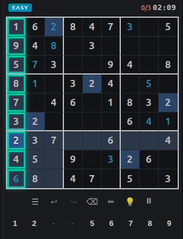
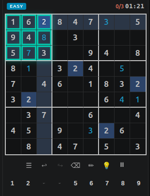
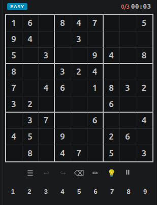
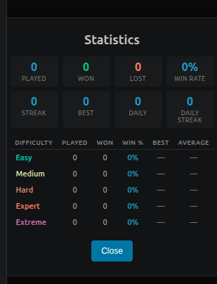

# Sudoku VS

A fully-featured Sudoku game inside VS Code. Play Sudoku without leaving your editor!

## Screenshots

| Game Board | Game Board |
|:---:|:---:|
|  |  |

| Menu | Statistics |
|:---:|:---:|
|  |  |

## Features

- **Classic Sudoku** - Play randomly generated puzzles at various difficulty levels
- **Daily Challenge** - A new puzzle every day
- **Statistics** - Track your performance over time
- **Multiple Themes** - Auto, Light, Dark, and Classic themes
- **Auto Notes** - Automatically calculate pencil marks
- **Hints** - Get help when you're stuck
- **Customizable Controls** - Support for different keyboard layouts

## How to Play

1. Open the Sudoku view from the activity bar (or use the Command Palette `Ctrl+Shift+P` and search for "Sudoku")
2. Start a new game, continue a saved game, or try the daily challenge
3. Fill the grid so that every row, column, and 3x3 box contains the digits 1-9

## Commands

| Command | Description |
|---------|-------------|
| `Sudoku: New Game` | Start a new Sudoku puzzle |
| `Sudoku: Continue Game` | Resume your last game |
| `Sudoku: Daily Challenge` | Play today's puzzle |
| `Sudoku: Statistics` | View your game statistics |
| `Sudoku: Settings` | Open VS Code settings for Sudoku VS |

## Extension Settings

These are VS Code extension settings — accessible via `Sudoku: Settings` from the Command Palette, or go to `File > Preferences > Settings` and search for "sudoku-vs".

| Setting | Description |
|---------|-------------|
| `sudoku-vs.theme` | Theme for the Sudoku board (auto, light, dark, classic) |
| `sudoku-vs.autoNotes` | Automatically calculate possible candidates |
| `sudoku-vs.maxMistakes` | Maximum mistakes allowed (0 = disabled) |
| `sudoku-vs.showErrors` | Show errors on the board |
| `sudoku-vs.pauseOnBlur` | Pause game when webview loses focus |
| `sudoku-vs.enableHints` | Enable hints |
| `sudoku-vs.inputProfile` | Input key mapping profile |
| `sudoku-vs.customKeyMap` | Custom key mapping |

## License

[MIT](LICENSE.md)
